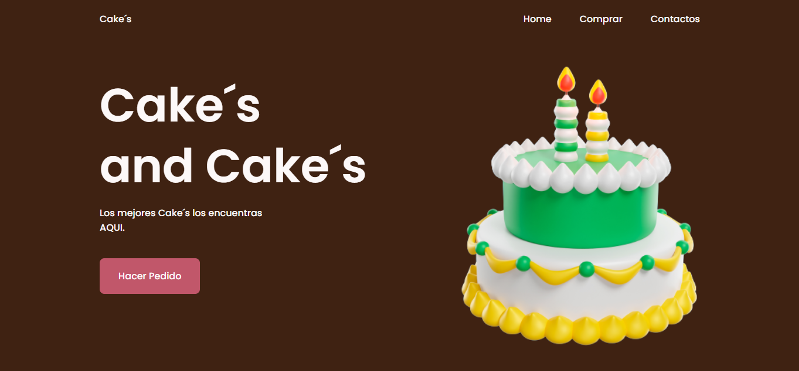
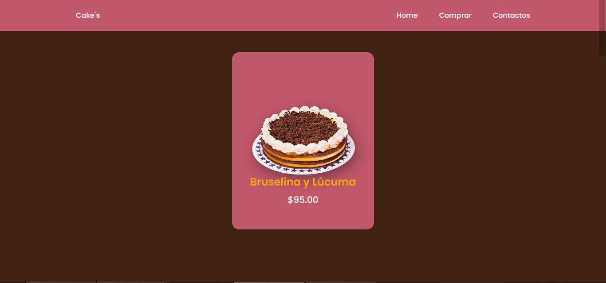
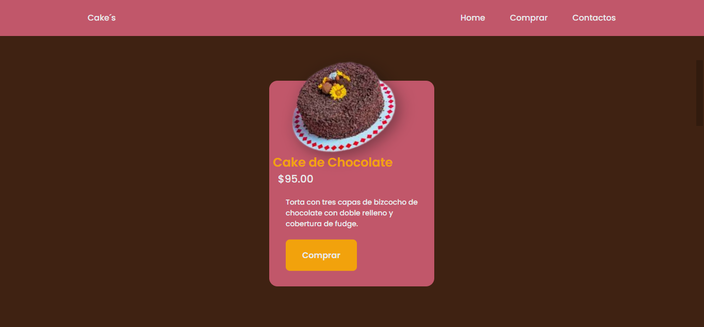
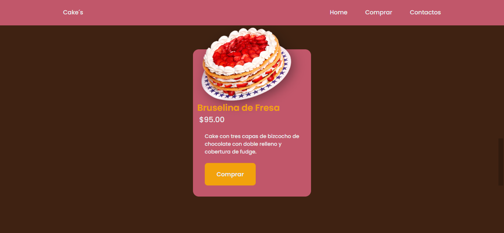
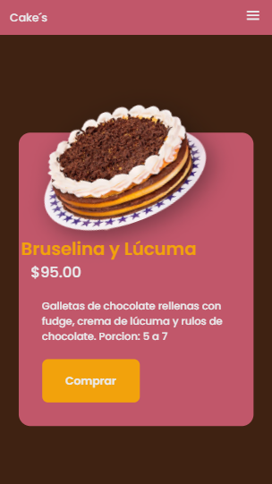

###PROYRCTO 2 HTML

#Capturas del proyecto

#1.-

#2.-

------------

#3.-

------------

4.-
------------

5.-
------------

#WEB
[WEB DEL PROYECTO ](http://cake12.42web.io/index.html "WEB DEL PROYECTO ")

